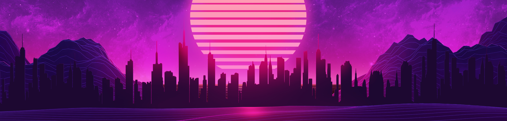

Hey there :wave:

Last open source repo: [Entity Component System](https://github.com/Kostayne/ecs)

<!-- contacts -->

## Want to learn / work with
- web
- mobile
- dApps
- system programming

## Opensource
Golang:
- [Entity Component System](https://github.com/Kostayne/ecs)

Crypto (ETH):
- [ERC20 Token with wallet](https://github.com/Kostayne/own-crypto-token)

Here is a list of my open source npm packages:
- [K_Signals](https://www.npmjs.com/package/k-signals)
- [Base ts result](https://www.npmjs.com/package/base-ts-result)
- [React modifier](https://www.npmjs.com/package/react-modifier)
- [React components manager](https://www.npmjs.com/package/k-react-cm)
- [Get module style](https://www.npmjs.com/package/get-module-style)
- [Rehype absolute image](https://www.npmjs.com/package/rehype-abs-image)
- [Rehype image size attribute](https://www.npmjs.com/package/rehype-img-size-attr)

<!-- ## Hosted pet projects -->
<!-- - [Personal site with blogs](https://kostayne.dev/) -->

## Tools that i use:
- Js, Ts (Primary) | Go, Rust, C++
- React, Vue, Svelte, Qwik
- Astro, Next
- Webpack, Vite, Esbuild, Swc
- MaterialUi, ChakraUi, AntDesign 
- Scss, Tailwind, Styled components
- React query, Swr
- Mobx, Redux
- Floating ui